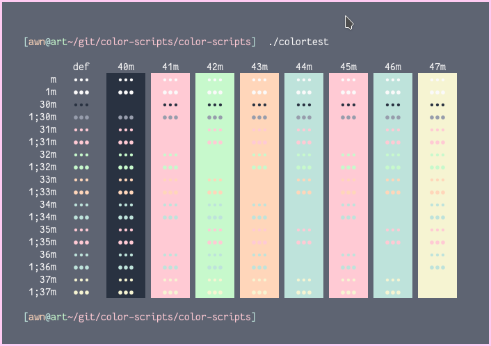
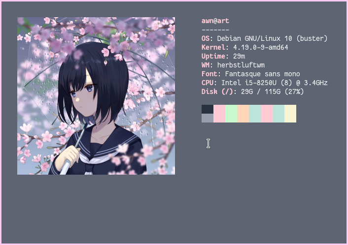

```bash
▒██   ██▒    ██▀███  ▓█████   ██████  ▒█████   █    ██  ██▀███   ▄████▄  ▓█████   ██████
▒▒ █ █ ▒░   ▓██ ▒ ██▒▓█   ▀ ▒██    ▒ ▒██▒  ██▒ ██  ▓██▒▓██ ▒ ██▒▒██▀ ▀█  ▓█   ▀ ▒██    ▒
░░  █   ░   ▓██ ░▄█ ▒▒███   ░ ▓██▄   ▒██░  ██▒▓██  ▒██░▓██ ░▄█ ▒▒▓█    ▄ ▒███   ░ ▓██▄   
 ░ █ █ ▒    ▒██▀▀█▄  ▒▓█  ▄   ▒   ██▒▒██   ██░▓▓█  ░██░▒██▀▀█▄  ▒▓▓▄ ▄██▒▒▓█  ▄   ▒   ██▒
▒██▒ ▒██▒   ░██▓ ▒██▒░▒████▒▒██████▒▒░ ████▓▒░▒▒█████▓ ░██▓ ▒██▒▒ ▓███▀ ░░▒████▒▒██████▒▒
▒▒ ░ ░▓ ░   ░ ▒▓ ░▒▓░░░ ▒░ ░▒ ▒▓▒ ▒ ░░ ▒░▒░▒░ ░▒▓▒ ▒ ▒ ░ ▒▓ ░▒▓░░ ░▒ ▒  ░░░ ▒░ ░▒ ▒▓▒ ▒ ░
░░   ░▒ ░     ░▒ ░ ▒░ ░ ░  ░░ ░▒  ░ ░  ░ ▒ ▒░ ░░▒░ ░ ░   ░▒ ░ ▒░  ░  ▒    ░ ░  ░░ ░▒  ░ ░
 ░    ░       ░░   ░    ░   ░  ░  ░  ░ ░ ░ ▒   ░░░ ░ ░   ░░   ░ ░           ░   ░  ░  ░  
 ░    ░        ░        ░  ░      ░      ░ ░     ░        ░     ░ ░         ░  ░      ░  
                                                                ░                        
```

## About
Xresources is a user-level configuration dotfile.

## Table of content
* [Font](#Font)
* [Unicode-rxvt](#Unicode-rxvt)
* [Color schemes](#Color-schemes)
* [Photos](#Photos)

---

### Font
In the config, just set the dpi and antialias.


### Unicode-rxvt
For fit the config, you need [perl extensions](https://github.com/muennich/urxvt-perls) installed.<br>
Which provide the extensions needed for my config.<br>
If you cannot install it,just [download](https://github.com/bookercodes/awesome-urxvt) the indicaded files below, and put in `~/.urxvt/ext` folder.

Perl Extensions used
+ Clipboard (for clipboard copy/pasting)
+ Resize-font (for dinamically resize the font size)
+ Matcher (for hightlight urls)

### Color schemes
+ Whitenord
+ Whiteful
+ Her
+ Graypastel
+ Graypastel2
+ Dark

### Photos
**Graypastel**<br>
<br>

