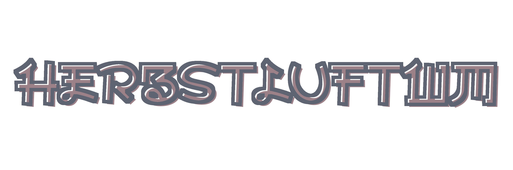

*last updated: 19 July 20* 
*version: 0.8.2*

## About Herbstluftwm:

<strong><a href="https://herbstluftwm.org/">Herbstluftwm</a></strong> is a manual tiling window manager. 
Is characterized by his frames

`Details:`
+ **Os**: Debian '10' Buster
+ **Terminal**: konsole
+ **Shell**: zsh + powerlevel10k
+ **Panel**: Polybar
+ **Applications**: neofetch, htop, feh, colorls

**You gonna need all this files to let herbstluftwm work properly** 
Excepto los temas, solo necesitas uno de ellos. 
Also, you can take this as an example or for your own ricing. 

[Video gif del setup]

## Table of content
+ [Dependences](#Dependences)
	- [Requiered](#Requiered-dependences)
	- [Optional](#Optional-dependences)
 	- [Fonts](#Fonts)
+ Features
	- Updates
+ [File structure](#File-structure)
	- [Main file](#Main-file)
	- [Window and frames](Window-and-frames)
	- [Workspaces](#Workspaces)
	- [Keybinds](#Keybinds)
		- [Examples](#Some-keybinds)
	- Theme
	- [Rules](#Rules)
		- [Examples](#Some-rules)
	- [Startup programs](#Startup-programs)
	- Panel
+ [Gallery] < Pictures/#Herbstluft
+ [To Do](#To-Do)
	- [Issues](#Issues)
	- [Integrate](#Integrate)

## Dependences
### Requiered dependences
* **Herbstluft** obviously
* **Feh**	-> set the wallpaper
* **Polybar**	-> panel
* **Dunst**	-> notificacionts
* **Rofi**	-> launcher
* ..

### Optional dependences
* **Greenclip** for clipboard manager with Rofi
* **clip** for multiple clipboard operations
* **MPD** - **MPC** for media player CLI
* **xbacklight** for brightness control
* **Playerctl** for multiple media control, include spotify

### Fonts
Needed fonts for the setup:
* .. for setup
* .. for terminal
* .. for panel/ rofi

## File structure
Explanation about what do every file. 
Son nombrados en singular por facilidad y estan ordenados segun quien arranca primero en el archivo principal. 
Inicia Herbstluftwm en 7 very simples pasos :)

### Main file
**File name: "autostart"**

Is like the main function to start the wm. 
Just clear previous config, export variables and call the other functions.

### Window and frames
**File name: "window.sh"**

Here is the most extensive config for hl. 
Set the keybind to manage: 
**Focus, Moving, Frames, Resize, Layout and Mouse keybinds.** 
In general is for window manipulation.

### Workspaces
**File name: "workspace.sh"**

Set all the virtual workspace. 
Originalmente se llaman TAGS, pero ya que se encarga de los escritorios virtuales, su nombre generico seria workspace.
You can adjust cuantos quieres aqui. 
Actualmente hay 10.

### Keybinds
**File name: "keybind.sh"**

Here are the keybinds for **launch programs and scripts** but non for set the keyboards for window manage. 
*For manipulation of window and frames, see [window and frames]*

#### Some keybinds
| Key | Produce? |
| :-: | :------: |
| Key1| btw1     |
| Key2| btw1     |
| Key3| btw1     |
| Key4| btw1     |
| Key5| btw1     |
| Key6| btw1     |

### Theme
**File name: "HlThemes/theme.sh"**

Does that, set the theme that herbstluftwm will going to use. 
You can change the theme just renaming [here]*linea donde se llama* 

*For more information enter in the [HlThemes folder]*

### Rules
**File name: "rule"**

Set the rules las cuales deban cumplir las ventanas. 
¿How to break the rules for cierta ocacion?

#### Some rules
* open browser in 2nd workspace
* 2nd workspace is floating by default
* open terminal in 1st workspace

### Startup programs
**File name: "startup"**

Set the principal programs that will initialize on login. 
Some of them are deamons, otros son programas como el browser.
Si quieres que añadir un programa, pon **"run"** al principo de la linea, ya que se verifica si no esta corriendo, entonces se inicia. Esto se define en la funcion run.
De lo contrario, si tienes por ejemplo el terminal abierto y recargas, te va a volver a cargar el programa como si estuviese iniciando.

### Panel
**File name: "PbThemes/polybar.ini"**

Set the config for the panel, but **not for launch it explicitly**. 
In this case, i use polybar as panel, so herbstluft call this file to set the config. 
The call is produced in [startup file]*linea donde se llama* 
*For more information enter in the [PbThemes folder]*

Puedes no usar Polybar, y usar la barra que quieras, como dzen,tint2,etc. Solo tienes que borrar [esta linea]*linea donde se llama* y reemplazarla por el programas que elijas

## To Do
Things that one day gonna make

### Issues
* Get stuck when get a screenshot to clipboard
* The maim command set in [startup.sh]*poner linea* doesnt work well :(
* The maim command set in [startup.sh]*poner linea* dont renovate every time i take a screenshot

### Integrate
* Better system to check the keybind config when creating a new one
