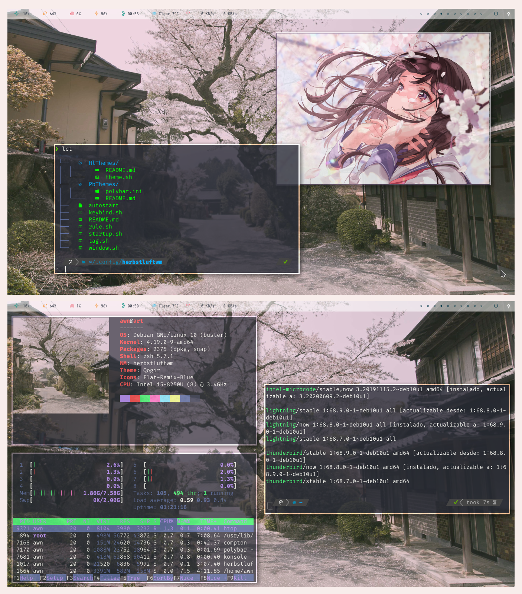

*last updated: 19 July 20* 
*version: 0.8.2*

## About Herbstluftwm:

<strong><a href="https://herbstluftwm.org/">Herbstluftwm</a></strong> is a manual tiling window manager for x11. Is characterized by the layout which is based on splitting frames into subframes and the ability to multi monitor setup with X tags per monitor. 
It's also written from scratch in C and configured with a bash script.

`Details:`
+ **Os**: Debian '10' Buster
+ **Terminal**: konsole
+ **Shell**: zsh + powerlevel10k
+ **Bar**: Polybar
+ **Applications**: neofetch, htop, feh, colorls
+ **Compositor**: Compton

**You gonna need all this files to let herbstluftwm work properly** 
Except themes (HlThemes,PbThemes), you just need one of them. 
Also, you can take this as an example or for your own ricing. 

[Video gif del setup]

## Table of content
+ [Dependences](#Dependences)
	- [Requiered](#Requiered-dependences)
	- [Optional](#Optional-dependences)
 	- [Fonts](#Fonts)
+ Features
	- Updates
+ [File structure](#File-structure)
	- [Main file](#Main-file)
	- [Window and frames](#Window-and-frames)
	- [Workspaces](#Workspaces)
	- [Keybinds](#Keybinds)
		- [Examples](#Some-keybinds)
	- [Theme](https://github.com/yowls/dotfiles/tree/debian/.config/herbstluftwm/HlThemes)
	- [Rules](#Rules)
		- [Examples](#Some-rules)
	- [Startup programs](#Startup-programs)
	- [Bar](https://github.com/yowls/dotfiles/tree/debian/.config/polybar)
+ [Gallery](https://github.com/yowls/dotfiles/tree/debian/Pictures#herbstluftwm)
+ [To Do](#To-Do)
	- [Issues](#Issues)
	- [Integrate](#Integrate)

## Dependences
### Requiered dependences
* **Herbstluft** obviously
* **Feh**	-> set the wallpaper
* **Polybar**	-> bar
* **Dunst**	-> notificacionts
* **Rofi**	-> launcher
* **Compton**	-> Compositor

Herbstluft come with dzen2 as default bar but i instead use polybar.

### Optional dependences
* **Greenclip** for clipboard manager with Rofi
* **xclip** for multiple clipboard operations
* **MPD** - **MPC** for media player CLI
* **xbacklight** for brightness control
* **Playerctl** for multiple media control, include spotify

### Fonts
Needed fonts for the setup:
* .. for general setup
* .. for polybar
* .. for rofi
* [Any NerdFont](https://github.com/ryanoasis/nerd-fonts) for terminal

## File structure
Explanation about what do every file. 
They are written in singular by ease by naming them and sorted according to who starts first in the main file. 
Herbstluftwm start in 7 simple steps :)

### Main file
**File name: "autostart"**

Is like the main function to start the wm. 
Just clear previous config, export variables and call the other files.

### Window and frames
**File name: "window.sh"**

Here is the most extensive config for hl. 
Set the keybind to manage: 
**Focus, Moving, Frames, Resize, Layout and Mouse keybinds.** 
In general is for window manipulation.

### Workspaces
**File name: "workspace.sh"**

Set all the virtual workspaces and the keybinds to switch to these. 
Originally called TAGS, but since they take care of the virtual desks, its generic name would be.
You can adjust as many as you want. 
There are currently 10.

### Keybinds
**File name: "keybind.sh"**

Here are the keybinds for **launch programs and scripts** but not to set the keybinds for window manage. 
*For manipulation of window and frames, see* [window and frames](https://github.com/yowls/dotfiles/tree/debian/.config/herbstluftwm#window-and-frames)

#### Some keybinds
| Key | Produce? |
| :-: | :------: |
| Key1| btw1     |
| Key2| btw1     |
| Key3| btw1     |
| Key4| btw1     |
| Key5| btw1     |
| Key6| btw1     |

### Theme
**File name: "HlThemes/theme.sh"**

Does that, set the theme that herbstluftwm will going to use. 
You can change the theme just renaming [Here](https://github.com/yowls/dotfiles/blob/debian/.config/herbstluftwm/autostart#L28) 
Or you can create one and put in that folder then rename the autostart file

*For more information enter in the* [HlThemes folder](https://github.com/yowls/dotfiles/tree/debian/.config/herbstluftwm/HlThemes)

### Rules
**File name: "rule.sh"**

Sets the rules that windows must comply. 
¿How to break the rules for cierta ocacion?

#### Some rules
* open browser in 2nd workspace
* 2nd workspace is floating by default
* open terminal in 1st workspace

### Startup programs
**File name: "startup.sh"**

Sets the programs that start on login. 
Some of them are deamons, others are programs like the browser,compositor,etc.
If you want to add a program, put **"run"** at the beginning of the line, because it is verified that it is not running. This is defined in the same function run.
Otherwise, if you have, for example, the terminal open and reloads, it will spawn again as if it were starting.

### Bar

In this case, i use polybar as bar, so herbstluft call this file to set the config. 
The call is produced in [here](https://github.com/yowls/dotfiles/blob/debian/.config/herbstluftwm/autostart#L29) 
*For more information enter in the* [Polybar Themes Folder](https://github.com/yowls/dotfiles/tree/debian/.config/polybar)

You may not use Polybar, and use the bar you want, such as dzen2,tint2, etc. Just delete [This Line](https://github.com/yowls/dotfiles/blob/debian/.config/herbstluftwm/autostart#L55) and replace it with the program of your choice.

## To Do
Things that one day gonna make

### Issues
* Get stuck when get a screenshot to clipboard
* The maim command set in [startup.sh]*poner linea* doesnt work well :(
* The maim command set in [startup.sh]*poner linea* dont renovate every time i take a screenshot

### Integrate
* Better system to check the keybind config when creating a new one
