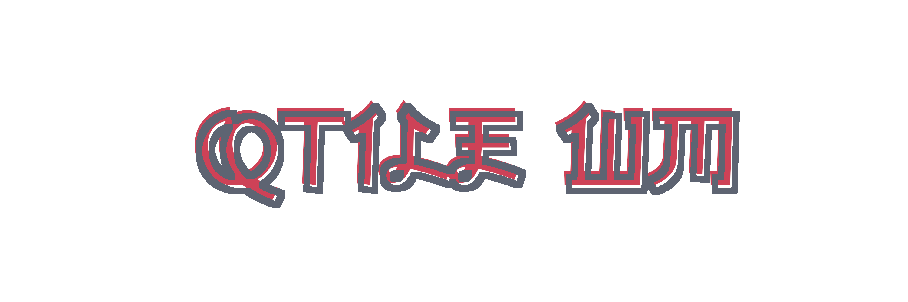

*last updated: 20 July 20* 
*version: 0.15.1*

## About Qtile

<strong><a href="http://www.qtile.org/">Qtile</a></strong> is a full-featured, hackable tiling window manager written and configured entirely in Python. 
Is characterized by ..

`Details:`
+ **Os**: Debian '10' Buster
+ **Terminal**: urxvt
+ **Shell**: zsh with powerlevel10k as theme
+ **Bar**: Built in
+ **Applications**: neofetch
+ **Compositor**: Compton

**You gonna need all this files to let Qtile work properly** 
Except themes (Themes,Bars), you just need one of them. 
Also, you can take this as an example or for your own ricing. 

## Table of content
+ [Dependences](#Dependences)
	- [Requiered](#Requiered-dependences)
	- [Optional](#Optional-dependences)
 	- [Fonts](#Fonts)
+ Features
	- Updates
+ [File structure](#File-structure)
	- [Main file](#Main-file)
	- [Window and frames](#Window-and-frames)
	- [Workspaces](#Workspaces)
	- [Keybinds](#Keybinds)
		- [Examples](#Some-keybinds)
	- [Theme](https://github.com/yowls/dotfiles/tree/debian/.config/qtile/Themes)
	- [Rules](#Rules)
		- [Examples](#Some-rules)
	- [Startup programs](#Startup-programs)
	- [Panel](https://github.com/yowls/dotfiles/tree/debian/.config/qtile/Bars)
+ [Gallery](https://github.com/yowls/dotfiles/tree/debian/Pictures#qtile)
+ [To Do](#To-Do)
	- [Issues](#Issues)
	- [Integrate](#Integrate)

## Dependences
### Requiered dependences
* [**Qtile**](https://github.com/qtile/qtile) obviously
* **Feh**	-> set the wallpaper
* **Dunst**	-> notificacionts
* **Rofi**	-> launcher
* **Compton**	-> Compositor

Currently using qtile with python 3, installed from github repo.

### Optional dependences
* **Greenclip** for clipboard manager with Rofi
* **xclip** for multiple clipboard operations
* **MPD** - **MPC** for media player CLI
* **xbacklight** for brightness control
* **Playerctl** for multiple media control, include spotify

### Fonts
Needed fonts for the setup:
* .. for general setup
* .. for panel
* .. for rofi
* [Any NerdFont](https://github.com/ryanoasis/nerd-fonts) for terminal

## File structure
Explanation about what do every file. 
They are written in singular by ease by naming them and sorted according to who is called first in the main file. 
Divided into 7 files in total. 
They're not named as they're by default, like groups -> workspaces or screens -> Bars. 

If something goes wrong, check debug in: 
`~/.local/share/qtile/qtile.log`

### Main file
**File name: "config.py"**

Is like the main function to start the wm. 
Import the other files config and set a few options.

### Window and frames
**File name: "window.py"**

Set the keybind to manage: 
**Focus, Moving, Resize, Layout and Mouse keybinds.** 
In general is for window manipulation.

### Workspaces
**File name: "workspace.py"**

Set all the virtual workspaces and the keybinds to switch to these. 
Originally called *GROUPS*, but since they take care of the virtual desks, its generic name would be.
You can adjust as many as you want. 
There are currently 10.

### Keybinds
**File name: "keybind.py"**

Here are the keybinds for **launch programs and scripts** but not to set the keybinds for window manage. 
*For manipulation of window and frames, see* [window and frames](https://github.com/yowls/dotfiles/tree/debian/.config/qtile#window-and-frames)

#### Some keybinds
| Key | Produce? |
| :-: | :------: |
| Key1| btw1     |
| Key2| btw1     |
| Key3| btw1     |
| Key4| btw1     |
| Key5| btw1     |
| Key6| btw1     |

### Theme
**File name: "Themes/'theme'.py"**

Does that, set the theme that Qtile will going to use. 
You can change the theme just renaming [Here](https://github.com/yowls/dotfiles/blob/debian/.config/qtile/config.py#L19) 
Or you can create one and put in that folder then rename again.

*For more information enter in the* [Themes folder](https://github.com/yowls/dotfiles/tree/debian/.config/qtile/Themes)

### Rules
**File name: "rule.py"**

Sets the rules that windows must comply. 
¿How to break the rules for cierta ocacion?

#### Some rules
* open browser in 2nd workspace
* 2nd workspace is floating by default
* open terminal in 1st workspace

### Startup programs
**File name: "autostart.sh"**

Sets the programs that start on login. 
Some of them are deamons, others are programs like the browser,compositor,etc. 
If you want to add a program, put **"run"** at the beginning of the line, because it is verified that it is not running. This is defined in the same function run. 
Otherwise, if you have, for example, the terminal open and reloads, it will spawn again as if it were starting.

### Panel
**File name: "Bars/'bar_theme'.py"**

Set the config for the panel. 
The call is produced [here](https://github.com/yowls/dotfiles/blob/debian/.config/qtile/config.py#L23) 
*For more information enter in the* [Bar Themes Folder](https://github.com/yowls/dotfiles/tree/debian/.config/qtile/Bars)

Also you can use the bar you want, such as polybar,tint2, etc. Just delete [This Line](https://github.com/yowls/dotfiles/blob/debian/.config/qtile/config.py#L23) and in [autostart file](https://github.com/yowls/dotfiles/blob/debian/.config/qtile/autostart.sh) run the program of your choice.

## To Do
Things that one day gonna make

### Issues
nothing recorded yet :)

### Integrate
* Better system to check the keybind config when creating a new one
* Pop up of error in file like awesome does
