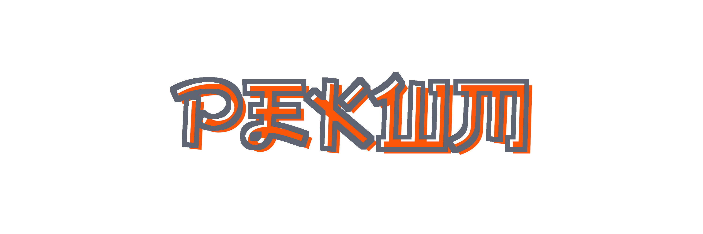
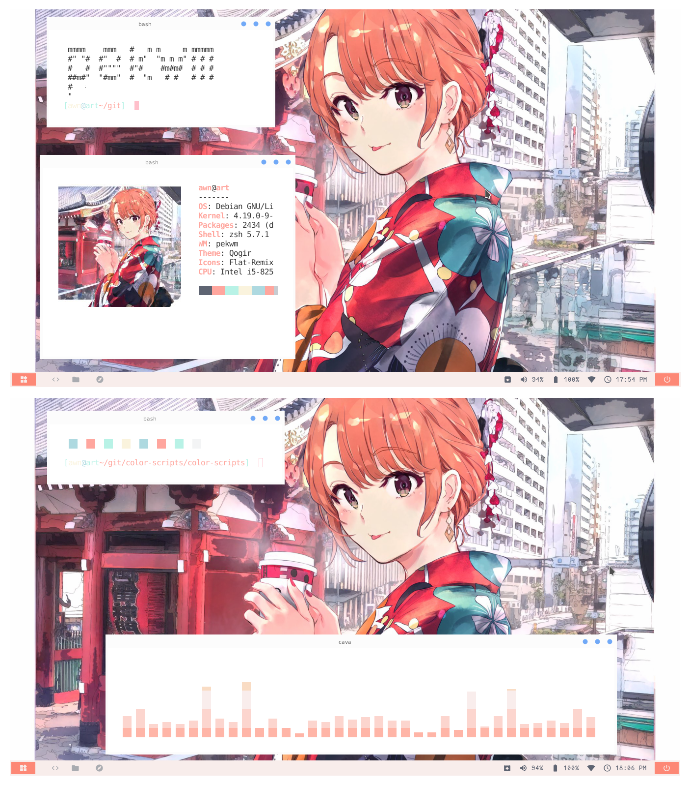

*last updated: 19 July 20* 
*version: 0.1.17*

## About PekWm

<strong><a href="https://www.pekwm.org/">PekWM</a></strong> is a .... 
It's also written from scratch in C and configured with a bash script.

`Details:`
+ **Os**: Debian '10' Buster
+ **Terminal**: konsole
+ **Shell**: zsh + powerlevel10k
+ **Bar**: Polybar
+ **Applications**: neofetch, htop, feh, colorls
+ **Compositor**: Compton

**You gonna need all this files to let herbstluftwm work properly** 
Except themes (besides polybar config), you just need one of them. 
Also, you can take this as an example or for your own ricing. 

[Video gif del setup]

## Table of content
+ [Dependences](#Dependences)
	- [Requiered](#Requiered-dependences)
	- [Optional](#Optional-dependences)
 	- [Fonts](#Fonts)
+ Features
	- Updates
+ [File structure](#File-structure)
	- [Main file](#Main-file)
	- [Window and frames](#Window-and-frames)
	- [Workspaces](#Workspaces)
	- [Keybinds](#Keybinds)
		- [Examples](#Some-keybinds)
	- [Theme](https://github.com/yowls/dotfiles/tree/debian/.config/herbstluftwm/HlThemes)
	- [Rules](#Rules)
		- [Examples](#Some-rules)
	- [Startup programs](#Startup-programs)
	- [Bar](https://github.com/yowls/dotfiles/tree/debian/.config/polybar)
+ [Gallery](https://github.com/yowls/dotfiles/tree/debian/Pictures#herbstluftwm)
+ [To Do](#To-Do)
	- [Issues](#Issues)
	- [Integrate](#Integrate)
