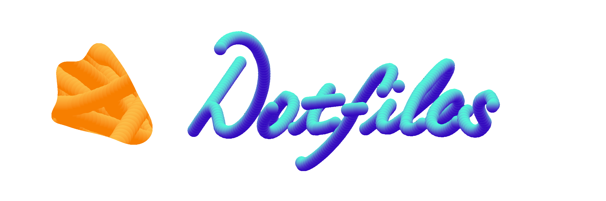

<p align="center" >
 <br>
 <b> config files for GNU/Linux and BSD </b>
</p>
<p align="center">
<a href="https://github.com/yowls/Scripts"></a>
<a href="https://github.com/yowls/Startpages"></a>
<a href="https://github.com/yowls/FirefoxCSS"></a>
</p>


## Table of contents:
+ [**Introduction**](#Introduction)
	- About
	- FAQs
	- What you gonna find in this branch
	- Also see for my other branchs
+ [**Screenshots**](#Screenshots)
	- Plasma setup
	- Qtile setup
	- Herbstluftwm setup
+ [**Dependences**](#Dependences)
	- Must have
	- For Qtile
	- For Herbstluftwm
+ [**Installation**](#Installation)
	- Preparations
	- Execute
+ [**List of programs**](#List-of-programs)
	- Principal
	- others
	- fonts?
+ [**Extra information**](#Extra-information)
	- Qtile
	- Herbstluftwm
	- Others
+ [Known issues]
+ [Gallery]
+ [Acknowledgement]
+ [Contributors] ?
+ [Social media]
+ [Licence]

<br>
> "some time i feel cool even paralize"<br>
> -- <cite>Carl Sagan</cite>

### About

<p align=right>
Hello there, im big fan working with fancy and nice looking things, nada mejor que prender el pc y ver un bonito escritorio, desde que vi r/unixporn era cuestion de tiempo empezar a trabajar en esto y quizas le he dedicado mas tiempo del que me gustaria decir.
This is my config files for programs that i daily use and wanted to save in one place
not only for me but for everyone out there.<br>
</p>

### FAQs
<p>
The word dotfile refer to any program that his config file start with a dot, for example: .zshrc is for zsh in the home directory.<br>
Also in this repository i refer to "rice" which mean a set of customization just to look good.<br>
</p>
(I use arch btw)

### What you gonna find in this branch:<br>
**Plasma** as Desktop Environment <br>
**Qtile** && **Herbstluft** as Window Manager <br>

### Also see for my other branchs:
+ [master branch](https://github.com/yowls/dotfiles/tree/master) --- --- ---{ Summary }
+ [Arch branch](https://github.com/yowls/dotfiles/tree/arch) --- --- --- ---{ Awesome wm + openbox }
+ [Freebsd branch](https://github.com/yowls/dotfiles/tree/freebsd)--- -- ---{ Bspwm + 2bwm }

## Screenshots
Just a fews screenshots of my setup in Debian
### [Plasma]
`Details:`
+ **DE**: KDE plasma (5.14.5)
+ **KDE plasma rules**: ..
+	**Theme**:
+	**Icons**:
+	**Applications**:
+	**Zsh theme**:

### [Qtile]
`Details:`
+	**Wm**: Qtile (0.15.1)

### [Herbstluftwm]
`Details:`
+	**Wm**: Herbstluftwm (0.8.2)

For more details see [here](link to gallery)

## Dependences
### Must have:
Programs that i use in every setup
* Zsh + [Oh my Zsh](https://github.com/ohmyzsh/ohmyzsh) + [Power Level 10K](https://github.com/romkatv/powerlevel10k)
* Rofi

### If you want to use [QTile](wiki)  see more information here:
* [More info about qtile rice](Qtile page)

### If you want to use [Herbstluft](wiki) see more information here:
* [more info about herbstluft rice](Herbstluftwm page)


## Installation
### Preparations:
Make sure there´s no conflict between your files and **make a backup** of your files anyways, doing:
```shell
	cp {files}
```
And make sure you have all needed dependencies.

### Execute:
First clone the directory in home directoy:
```shell
	$ cd ~
	$ git clone --depth=1 https://github.com/yowls/dotfiles/tree/debian
```
Change zsh default shell with
```shell
	$ chsh -s zsh
```
You may want to reload xresources for apply some ??, also you could have to add it to some init file or ??
```shell
	$ xrdb ~/.Xresources
```
buala, that´s all.

## List of programs
In cualquier case, publico las versiones de los programas
por si en alguna futura actualizacion se rompe algo y
no lo he actualizado.

### Principal:
+ Browser      = Firefox (78.0.1)
+ Shell        = Zsh (5.7.1)
+ Terminal     = konsole (18.04.0)
+ Text editor  = Vim (8.1)
+ File Manager = Dolhin (18.08)
+ Compositor   = Picom [link to that picom] "version .."
+ Launcher     = Rofi (1.5.1)

### Others:
+ redshift for you pretty eyes
+ dunst for notification
+ ? for screenshots

### Fonts:
always is good to have a nerd font
+ [Nerd font](https://github.com/ryanoasis/nerd-fonts)
choose what you want
i personaly prefer Fira code


## Extra information:
### To know more about the details of every rice, i recommend to you see:
+ [More information about qtile]
+ [More about herbstluft]

### ZSH
Useful terminal aliases in .zshrc:
```
	code code code
```
### Xresources
xresources color scheme:
+ Color scheme
+ photo
+ photo demostration in terminal

*in master branch just put .colors,bg,fg*

## known issues
Nothing recorded yet.<br>
If you are having an issue, first check you are using the same version as me, then open a ticket at issue section or just make a pull request.

## Gallery
a few more photos<br>
[full gallery link]
