<!--Brach: Master-->
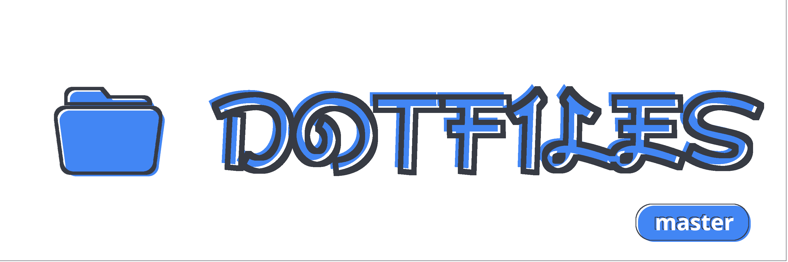<br><br>
<br>
<div align="center">
        <p><b> Related proyects </b></p>
        <a href="https://github.com/yowls/scripts">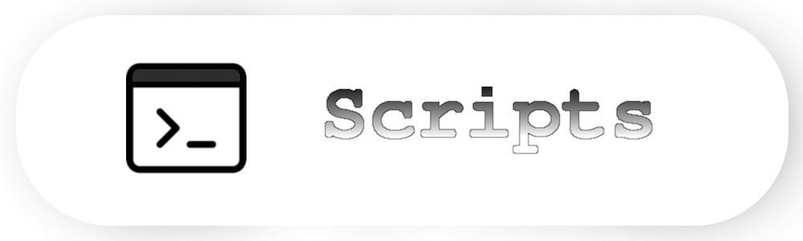</a>
        <a href="https://github.com/yowls/startpages">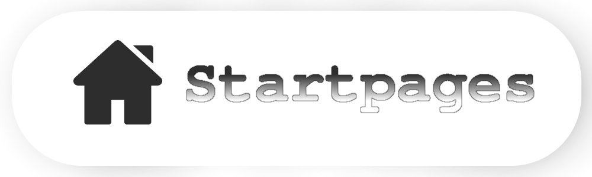</a>
        <a href="https://github.com/yowls/firefoxcss">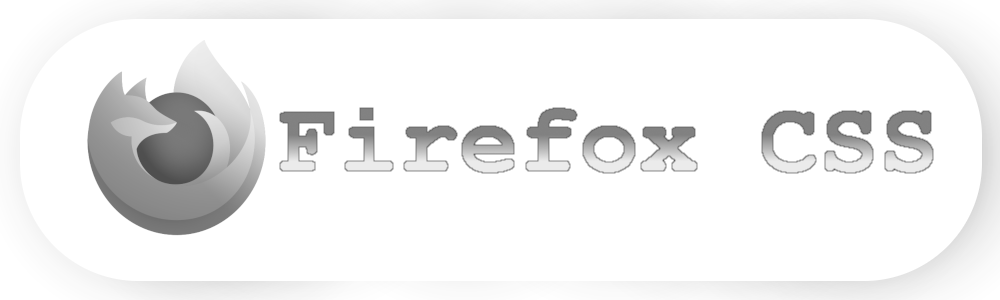</a>
</div>
<br>
<br>

> "A computer is like air conditioning, it becomes useless when you open Windows"<br>
> -- <cite>Linus Torvalds</cite>

### About
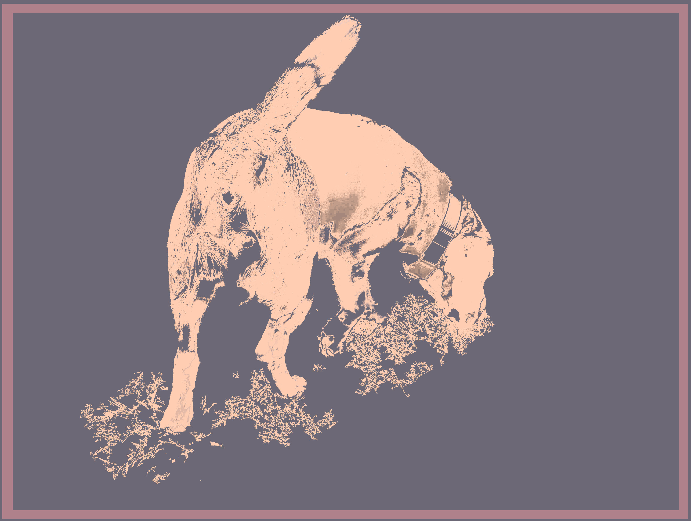
<p align=left>
Welcome! <br>
This is my first big repository, a collection of customizations for my UNIX like systems.<br>
My greatest inspiration was the subreddit <a href="https://www.reddit.com/r/unixporn/">r/Unixporn</a>. Since then I have been doing this since the beginning of 2020.<br>
This repository contains many configs for different programs, some of them were moved to their own repository because they were big enough to do so and are listed below.

Ah yeah of course, ***I use arch btw***
</p>
<br>
<br>
<!-- 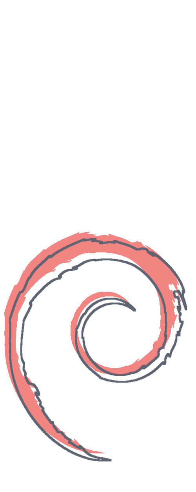 -->
<ul align=left>
<!-- Line .. -->
 <li>Information</li>
 <ul>
  <li><a href="https://github.com/yowls/dotfiles/wiki/Q&A">Q&A</a></li>
  <li><a href="https://github.com/yowls/dotfiles/wiki/configs">Configs for</a></li>
 </ul>
 <!-- Line 73 -->
 <li>Screenshots</li>
 <ul>
   <li><a href="https://github.com/yowls/dotfiles/#Plasma">Plasma</a></li>
   <li><a href="https://github.com/yowls/dotfiles/#PekWM">Pekwm</a></li>
   <li><a href="https://github.com/yowls/dotfiles/#Herbstluftwm">Herbstluftwm</a></li>
   <li><a href="https://github.com/yowls/dotfiles/#Qtile">Qtile</a></li>
 </ul>
<!-- Line 146 -->
 <li>Installation</li>
 <ul>
  <li><a href="https://github.com/yowls/dotfiles/#Preparations">Preparations</a></li>
  <li><a href="https://github.com/yowls/dotfiles/#Execute">Execute</a></li>
 </ul>
 </ul>
<br>
<br>

<br>
### Question & Answer
* [Q1]
* [Q2]
* [Q3]

### Configs for<br>
***Local***:<br>
[NeoVim](https://github.com/yowls/dotfiles/tree/master/.config/nvim)<br>
[Kitty](https://github.com/yowls/dotfiles/tree/master/.config/kitty)<br>
[Xresources related](https://github.com/yowls/tree/master/.Xresources.d)<br>
<!--
[Zsh]<br>
[Rofi config]<br>
-->

***External***<br>
[Polybar](https://github.com/yowls/pbar)

***Window managers***<br>
*Stacking*
* [openbox](https://github.com/yowls/dotfiles/tree/master/.config/openbox)
*Tiling*
* [Herbstluftwm](https://github.com/yowls/hlwm)
*Dynamic*
* [Awesome](https://github.com/yowls/awwn)

<br>
### Plasma
<p align="center">
  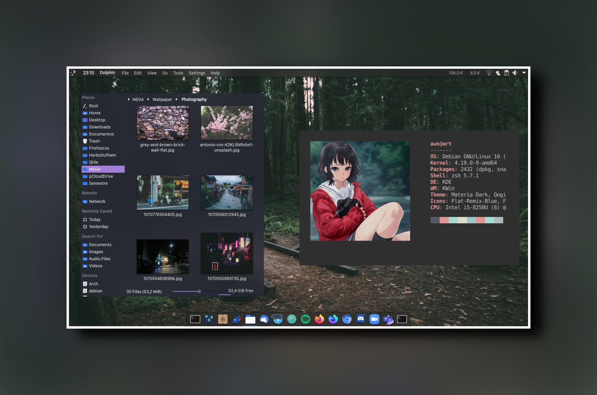
</p>
<p align="center">
  <sub>
  	<b>OS</b>: Debian Buster | <b>Theme</b>: <a href="">Materia</a> | <b>Icons</b>: <a href="">Flat remix</a> | <b>Wallpaper</b>: ..
  </sub>
</p>

<br>
<br>

### [Openbox](https://github.com/yowls/dotfiles/.config/openbox)
*Work in progress*
<!--
<p align="center">
  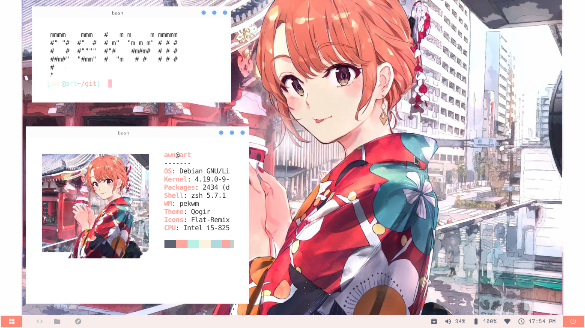
  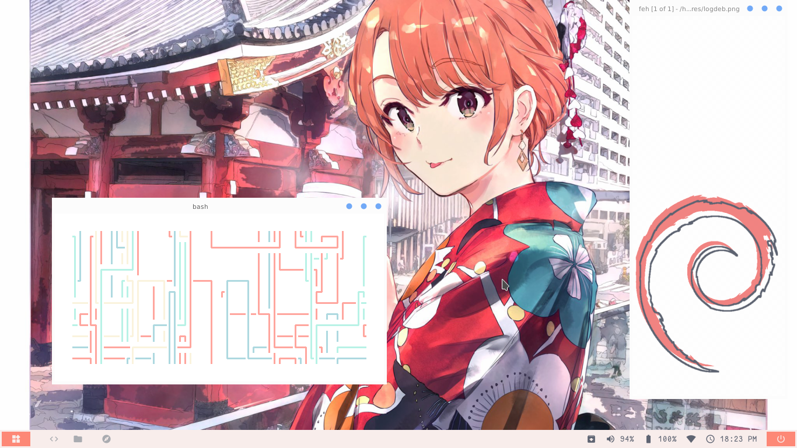
  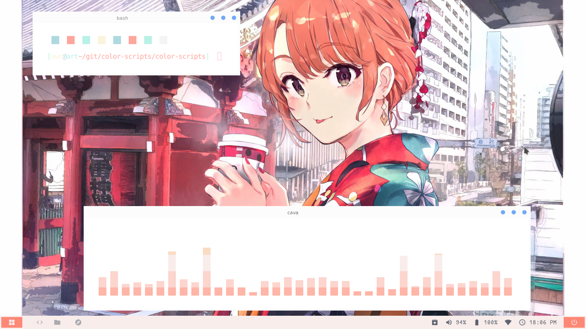
  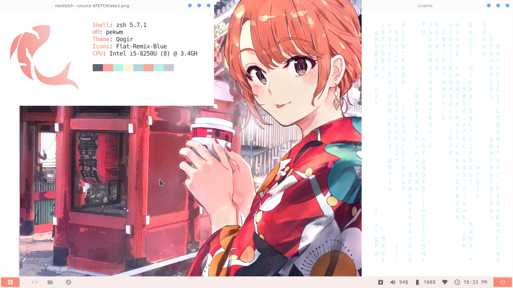
</p>
<p align="center">
  <sub>
  	<b>OS</b>: Debian Buster | <b>Bar</b>: Polybar (not mine) | <b>Theme</b>: <a href="https://www.box-look.org/p/1137146/">Minimalist</a> | <b>Wallpaper</b>: ..
  </sub>
</p>
-->
<br>
<br>

### [Herbstluftwm](https://github.com/yowls/hlwm)
<p align="center">
  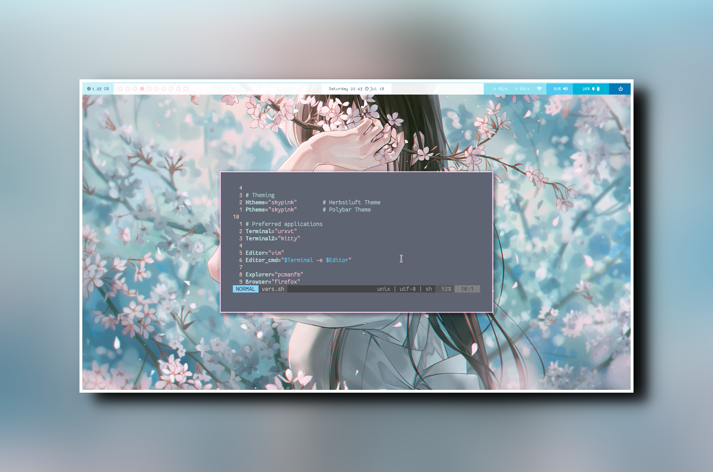
</p>
<p align="center">
  <sub>
  	<b>OS</b>: Debian Buster | <b>Bar</b>: Polybar (blueg) | <b>Code-name Theme</b>: Blueg | <b>Wallpaper</b>: ..
  </sub>
</p>

<br>
<br>

### [Qtile](https://github.com/yowls/dotfiles/.config/qtile)
*work in progress*
<!-- <p align="center">
  
  
  
  
</p>
<p align="center">
  <sub>
  	<b>OS</b>: OpenSuse | <b>Bar</b>: Built-in (..) | <b>Code-name Theme</b>: .. | <b>Wallpaper</b>: ..
  </sub>
</p>
-->
<br>
<br>

*For more photos see: [enter in gallery here](https://github.com/yowls/dotfiles/Pictures)*


<br>
### Preparations
Make sure there´s no conflict between your files and mine.<br>
**Make a backup** of your files anyways, don't replace with mine just<br>

### Execution
Clone the repository and copy the files:
```bash
	$ git clone --depth=1 https://github.com/yowls/dotfiles Yowls
	$ cp Yowls/.config $HOME/.config
	$ rm -rf Yowls #Optional
```
<br>

Also i made a simplified zsh and nvim config **for root**, to use it do:
```bash
	$ sudo mkdir -p /root/.config/nvim
	$ sudo cp Yowls/.config/nvim/root.init.vim /root/.config/nvim/init.vim
	$ sudo cp Yowls/.zsh.d/root.zshrc /root/.zshrc
```

<br>
This is MY setup and it is opinionated and made to work how I want. Anyone can download and use it, but unless you and me are the same person, you'll probably find things that you don't want. It is OK. Use this as a starting point for making your own.

Under no circumstances I am responsible for any kind of damage derived from the use of this on your machine. If you lose files, if your install breaks something, if something explodes. My dotfiles comes with no warranties. Again; you shouldn't play with my toys if you don't want to get hurt. (This doesn't mean my dotfiles will hurt you, you know, but this is legal boilerplate to cover my ass in case something happens).
