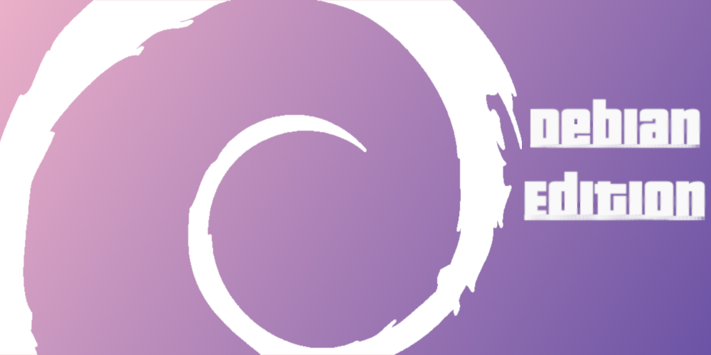

<div align= "center">
	<h3>
		[logo de mi repo]
	</h3>
	<p align="center" >
		<strong> config files for Linux and bsd </strong>
	</p>
	<h3>
		
	</h3>
</div>

<div>
	Related projects:
	<br>
	<a href="www.google.com"> Firefox css </a>
	<br>
	<a href="www.youtube.com"> Start pages </a>
	<br>
	<a href="www.wikipedia.com"> Scripts </a>
</div>

## Table of contents:
* [About](#About)
* [Some screenshots](#Some-screenshots)
* [Dependency](#Dependency)
* [Optional Dependency]
* [Installation]
* [List of programs]
* [Extra information]
* [Gallery]

## About
quote:
 "if we just .."
(profile pic)
hello there, this is my config files for programs that i daily use and wanted to save in one place
not only for me but for everyone

In this branch you can find personalization for
	Plasma as Desktop Environment
	Qtile and Herbstluft as Window Manager
(I use arch btw)

also see for other branchs:
	 [master branch]()      { Summary }
	 [Arch branch]()        { awesome wm + openbox }
	 [Branch upcomming..]() { bspwm + 2bwm }

## Some screenshots
[Plasma]
details:
	DE: KDE plasma
	theme:
	icons:
	applications:
	kde plasma rules: .....

[Qtile]
	Wm: Qtile (0.15.1)

[herbstluftwm]
	Wm: Herbstluftwm (0.8.2)

[Full gallery link]
for more details see: [Extra information]

## Dependency
* Zsh + [Oh my Zsh](https://github.com/ohmyzsh/ohmyzsh) + [Power Level 9K](https://github.com/Powerlevel9k/powerlevel9k/wiki/Install-Instructions#step-1-install-powerlevel9k)
* Rofi

If you want to use [QTile](link) also need to install:
* Feh for set the wallpaper
* Fonts used:
	* [Nerd fonts](https://github.com/ryanoasis/nerd-fonts),Fira code recommended
* [More info about qtile rice](#Extra-information)

If you want to use [Herbstluft](link) also need to install:
* dzen? for panel
* Feh for set the wallpaper
* Fonts used:
* [more info about herbstluft rice](#Extra-information)

## Optional Dependency

## Installation
Make sure there´s no conflict between your files and make a backup of that anyways
<br>
And make sure you have all needed dependencies
<br>
In home directoy do:
```shell
	git clone --depth?
```
Then:
<br>
Change zsh default shell with
```shell
		chsh -s zsh
```
reload xresources for color schemes
	xrdb /home/$USER/.Xresources

buala, that´s all.

## List of programs
Principal:
* Browser      = Firefox [link to fcss]
* Shell        = Zsh
* Terminal     = konsole
* Text editor  = Vim
* File Manager = Dolhin
* Compositor   = Picom [link to that picom]
* Launcher     = Rofi

Others:
* redshift for you pretty eyes
* ncmpcpp for music cli
* dunst for notification
* ? for screenshots

## Extra information:
[more about qtile]

[more about herbstluft]

Useful terminal aliases in .zshrc:
```
	code code code
```
xresources color scheme:
+ photo
+ photo demostration in terminal

*in master branch just put .colors,bg,fg*

## Gallery
a few photos
[full gallery link]
