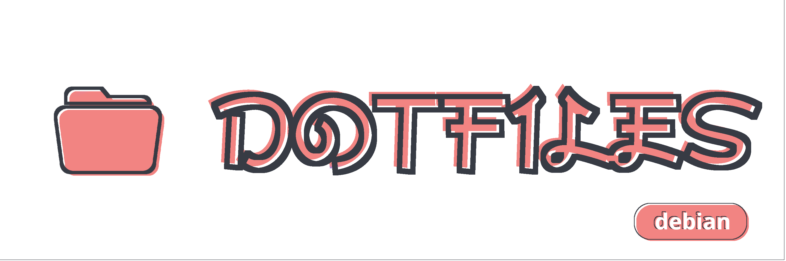
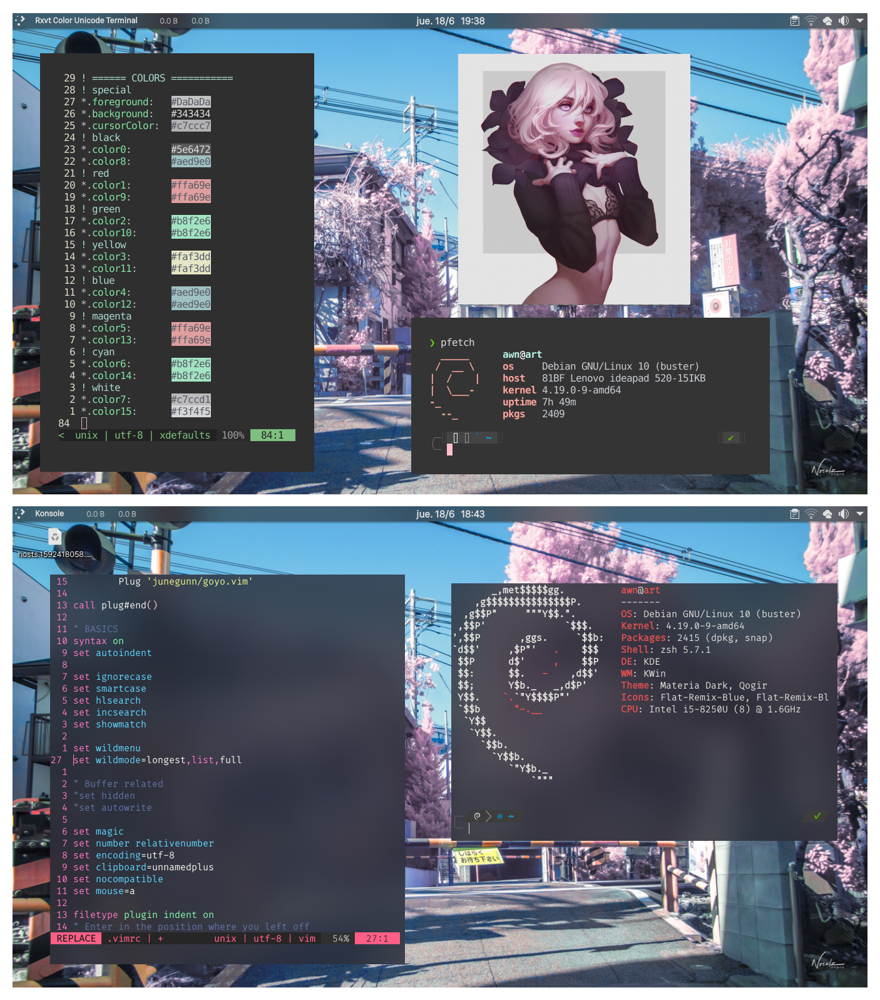
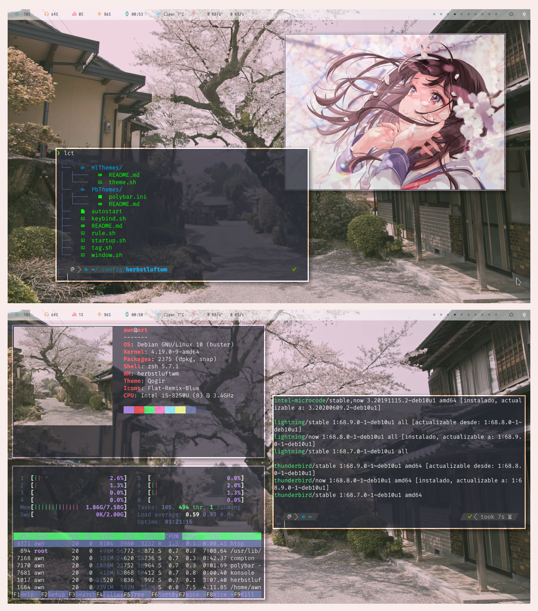

<br>
<p align="center"><b> config files for GNU/Linux and BSD </b></p>

<p align="center">
<a href="https://github.com/yowls/scripts"></a>
<a href="https://github.com/yowls/startpages"></a>
<a href="https://github.com/yowls/firefoxcss"></a>
</p>

<br>

<ul align=left>
<li>Introduction</li>
  <ul>
  <li><a href="https://github.com/yowls/dotfiles/tree/debian#about">About</a></li>
  <li><a href="https://github.com/yowls/dotfiles/tree/debian#Q&A">Q&A</a></li>
  <li><a href="https://github.com/yowls/dotfiles/tree/debian#What-you-gonna-find-here">What you gonna find in this branch</a></li>
  <li><a href="https://github.com/yowls/dotfiles/tree/debian#My-other-branchs">Check my other branchs</a></li>
  </ul>
<li>Screenshots</li>
  <ul>
  <li><a href="https://github.com/yowls/dotfiles/tree/debian#Plasma">Plasma setup</a></li>
  <li><a href="https://github.com/yowls/dotfiles/tree/debian#Qtile">Qtile setup</a></li>
  <li><a href="https://github.com/yowls/dotfiles/tree/debian#Herbstluftwm">Herbstluftwm setup</a></li>
  </ul>
<li>Dependences</li>
  <ul>
  <li><a href="https://github.com/yowls/dotfiles/tree/debian#Must-have">Must have</a></li>
  <li><a href="https://github.com/yowls/dotfiles/tree/debian#Recommended">Recommended</a></li>
  <li><a href="https://github.com/yowls/dotfiles/tree/debian/.config/qtile#Requiered-dependences">Qtile</a></li>
  <li><a href="https://github.com/yowls/dotfiles/tree/debian/.config/herbstluftwm#Requiered-dependences">Herbstluftwm</a></li>
  </ul>
<li>Installation</li>
  <ul>
  <li><a href="https://github.com/yowls/dotfiles/tree/debian#Preparations">Preparations</a></li>
  <li><a href="https://github.com/yowls/dotfiles/tree/debian#Execute">Execute</a></li>
  </ul>
<li>List of programs</li>
  <ul>
  <li><a href="https://github.com/yowls/dotfiles/tree/debian#Main">Main</a></li>
  <li><a href="https://github.com/yowls/dotfiles/tree/debian#Secondary">Secondary</a></li>
  </ul>
<li>Extra information</li>
  <ul>
  <li><a href="https://github.com/yowls/dotfiles/tree/debian/.config/qtile">Qtile</a></li>
  <li><a href="https://github.com/yowls/dotfiles/tree/debian/.config/herbstluftwm">Herbstluftwm</a></li>
  <li><a href="https://github.com/yowls/dotfiles/tree/debian#Others">Others</a></li>
  </ul>
<li><a href="https://github.com/yowls/dotfiles/tree/debian#Known-issues">Known issues</a></li>
<li><a href="https://github.com/yowls/dotfiles/tree/debian/Pictures">Gallery</a></li>
<li>Contributors</li>
<li>Acknowledgement</li>
<li>Social media</li>
<li>Disclaimer</li>
<li>Licence</li>
</ul>

<br>
> "A computer is like air conditioning, it becomes useless when you open Windows"<br>
> -- <cite>Linus Torvalds</cite>

### About

<p align=left>
Welcome! <br>
This is my first big repository, a collection of customizations for my UNIX based systems.<br>
My greatest inspiration was the subreddit <a href="https://www.reddit.com/r/unixporn/">r/Unixporn</a>. Since then I have been doing this since the beginning of 2020.<br>

About my setup, this repository has 3 current branches, one for every operating system I use on my laptop. Debian Buster, Arch linux and FreeBSD (in addition to windows). Yep i have multi boot.<br>

In each branch certain things change, such as used Desktop Environments(DE), Window Managers(WM) and some other program used.<br>
You can find more information about it if you change branches. Since each one is more specialized in that particular OS.<br>
The Master branch has nothing in particular, it is only a redirecting to the other branches. However, you can find some settings that I use on all OS, that is to say that for example, on all branches there's an archive .zshrc or a .vimrc identical or very similar.<br>
It is the common factor of all branches, and if in the future I get to add another, I always work from the main branch so there are no compatibility issues. Since I try to make it as vanilla as possible, compatible with most UNIX-based operating systems.<br>
ah and of course, **(I use arch btw)**
</p>

### Q&A
* **Im noob, What am I supposed to do here?**

Well, not much really, you can see the gallery/screenshots I did to see if it encourages you to experiment a little bit with *Nix* based OS. You can also find similar images in [r/unixporn](https://www.reddit.com/r/unixporn/)

* **Esto puede perjudicar a mi equipo?**

No deberias tener ningun problema, aunque siempre cae la posibilidad de que algo salga mal, en cualquier caso Linux es un OS suficiente robusto para poder arreglarlo.

* **What does 'Dotfiles' mean?**

The word 'dotfiles' refers to any configuration file that is used to modify a program. Algunos de ellos empiezan con un punto (los que estan en el directorio home), por ej: .zshrc. Otros estan en una carpeta llamada '.config'

* **¿Que significa 'ricing'?**

Bajo este contexto, se refiere a la palabra R.I.C.E (Race Inspired Cosmetic Enhancements), lo que es put parts on cars to make them look fast. En este caso, personalizar la interfaz para que se vea mejor.

### What you gonna find here<br>
**Plasma** as *Desktop Environment* <br>
[**Qtile**](https://github.com/yowls/dotfiles/tree/debian/.config/qtile) && [**Herbstluft**](https://github.com/yowls/dotfiles/tree/debian/.config/herbstluftwm) as *Window Manager* <br>

### My other branches
+ [Master branch](https://github.com/yowls/dotfiles/tree/master) --- --- ---{ Summary }
+ [Arch branch](https://github.com/yowls/dotfiles/tree/arch) --- --- --- ---{ Awesome wm + openbox }
+ [Freebsd branch](https://github.com/yowls/dotfiles/tree/freebsd)--- -- ---{ Bspwm + 2bwm }

<br>
Just a fews screenshots of my rice in Debian
### Plasma


`Details:`
+ **Os**: Debian Buster
+ **Theme**: Materia
+ **Icons**: Flat remix
+ **Zsh theme**: Powerlevel10k
+ **Terminals**: urxvt, konsole
+ **Decoration**: Neofetch, pfetch
+ **Other apps**:
  - vim
  - feh for the image
+ **KDE plasma rules**: No title bar and frame

<br>
<br>

### [Qtile](https://github.com/yowls/dotfiles/tree/debian/.config/qtile)


`Details:`
+ **Os**: Debian Buster
+ **Terminal**: Konsole
+ **Shell**: Zsh + powerlevel10k
+ **Panel**: Built in

<br>
<br>
<br>
<br>
<br>
<br>
<br>
<br>
<br>

### [Herbstluftwm](https://github.com/yowls/dotfiles/tree/debian/.config/herbstluftwm)


`Details:`
+ **Os**: Debian Buster
+ **Terminal**: konsole
+ **Shell**: Zsh with powerlevel10k
+ **Bar**: Polybar
+ **Applications**:
  - neofetch
  - htop
  - feh
  - colorls

<br>
<br>
<br>
*For more photos see: [enter in gallery here](https://github.com/yowls/dotfiles/tree/debian/Pictures)*

<br>
### Must have
Programs that i use in every setup and my config files depend on it.
Qtile and Herbstluft require aditional dependencies, but in both i use:
* Compton as compositor
* Rofi as application launcher and dmenu replacement
* Rxvt-Unicode as terminal
* Vim for text editing

### Recommended 
* Zsh + [Oh my Zsh](https://github.com/ohmyzsh/ohmyzsh) + [Power Level 10K](https://github.com/romkatv/powerlevel10k)
* [VimPlug](https://github.com/junegunn/vim-plug) for vim pluggins

Fonts
+ [Nerd font](https://github.com/ryanoasis/nerd-fonts)
choose what you want

### If you want to use QTile
[*See additional dependences*](https://github.com/yowls/dotfiles/tree/debian/.config/qtile#Dependences)

### If you want to use Herbstluftwm
[*see additional dependences*](https://github.com/yowls/dotfiles/tree/debian/.config/herbstluftwm#Dependences)

### If you plan to use Plasma
It doesnt requiered any special dependencies to work, just install some themes and widgets for the panel, and leave it as you want.

<br>
Instructions to set up my rice.<br>
You can complete all the dependences of only one to work with it.<br>
I made this setup in debian where the most are not in the latest version.

### Preparations
Make sure there´s no conflict between your files and mine.<br>
**Make a backup** of your files anyways, don't replace with mine just<br>
And make sure you have all needed dependencies to work properly.

### Execution
Elige cual de los dos (o los dos) wm vas a usar, luego<br>
Clone the repository:

```shell
	$ cd Downloads
	$ git clone https://github.com/yowls/dotfiles/tree/debian
	$ mv dotfiles/.config/qtile ../.config
	$ mv dotfiles/.config/herbstluftwm ../.config
```

Then logout and in the display manager choose your option.<br>
And buala, that´s all.

*I will do a script to do it automatically, i hope soon*

<br>
In any case, I publish the versions of the programs in case in any future update something broke and I haven't updated it yet.

### Main
+ Browser      = Firefox (78.0.1)
+ Shell        = Zsh (5.7.1)
+ Terminal     = konsole (18.04.0)
+ Text editor  = Vim (8.1)
+ File Manager = Dolhin (18.08)
+ Compositor   = Compton (0.1~beta2+20150922-1) (*debian version*)
+ Launcher     = Rofi (1.5.1)

--

+ Plasma  (5.14)
+ QTile   (0.15.1)
+ Herbstluftwm  (0.8.2)

### Secondary
+ redshift for filer
+ dunst for notification
+ flameshot in plasma and maim in wm´s for screenshots
+ ? for record?


<br>
### To know more about the details of every rice, see
+ [More information about Qtile](https://github.com/yowls/dotfiles/tree/debian/.config/qtile)
+ [More about Herbstluft](https://github.com/yowls/dotfiles/tree/debian/.config/herbstluftwm)

### Others

`Rxvt-Unicode (URxvt)`
All the config is in .Xresources file.<br>
Actually using: clipboard, resize-font and matcher as perl-extensions.

`Vim`
Im using [VimPlug] for vim plugins.<br>
Some of them are:
* Gitgutter
* NERDTree
* Lightline
* css-color

If you notice that clipboard doesnt work well when trying to pase from outside install **gvim**.<br>
This will give vim the ability to copy/paste from/to others programs.<br>
Otherwise, you can fix it using xclip, making a keybind in .vimrc replacing paste command. But the easiest way is just install gvim.

In my .vimrc im using **undodir** folder for a history of undo´s. So i can undo a line of a file previously closed

`Xresources`
Xresources color scheme:
+ Color scheme
 - [color scheme]
+ photo demostration in terminal
 - [demostration]

<br>
Nothing recorded yet.<br>
If you are having an issue, first check you are using the same version as me, then open a ticket at issue section or just make a pull request.

<br>
A few more photos<br>
[Check my full gallery](https://github.com/yowls/dotfiles/tree/debian/Pictures), all the setups of the branch here.

<br>
This is MY setup and it is opinionated and made to work how I want. Anyone can download and use it, but unless you and me are the same person, you'll probably find things that you don't want. It is OK. Use this as a starting point for making your own.

Under no circumstances I am responsible for any kind of damage derived from the use of this on your machine. If you lose files, if your install breaks something, if something explodes. My dotfiles comes with no warranties. Again; you shouldn't play with my toys if you don't want to get hurt. (This doesn't mean my dotfiles will hurt you, you know, but this is legal boilerplate to cover my ass in case something happens).
