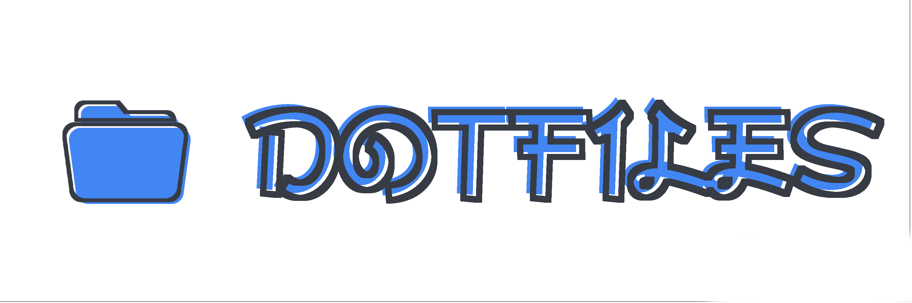

<!--Brach: Master-->
<br><br>
<br>
<div align="center">
        <p><b> Related proyects </b></p>
        <a href="https://github.com/yowls/scripts"></a>
        <a href="https://github.com/yowls/startpages"></a>
        <a href="https://github.com/yowls/firefoxcss"></a>
</div>
<br>
<br>

> "A computer is like air conditioning, it becomes useless when you open Windows"<br>
> -- <cite>Linus Torvalds</cite>

### About

<p align=left>
Welcome! <br>
This is my first big repository, a collection of customizations for my UNIX based systems.<br>
My greatest inspiration was the subreddit <a href="https://www.reddit.com/r/unixporn/">r/Unixporn</a>. Since then I have been doing this since the beginning of 2020.<br>

About my setup, this repository has 3 current branches, one for every operating system I use on my laptop. Debian Buster, Arch linux and FreeBSD (in addition to windows). Yep i have multi boot.<br>

In each branch certain things change, such as used Desktop Environments(DE), Window Managers(WM) and some other program used.<br>
You can find more information about it if you change branches. Since each one is more specialized in that particular OS.<br>
The Master branch has nothing in particular, it is only a redirecting to the other branches. However, you can find some settings that I use on all OS, that is to say that for example, on all branches there's an archive .zshrc or a .vimrc identical or very similar.<br>
It is the common factor of all branches, and if in the future I get to add another, I always work from the main branch so there are no compatibility issues. Since I try to make it as vanilla as possible, compatible with most UNIX-based operating systems.<br>
ah and of course, **(I use arch btw)**
</p>
<br>
<br>
<!--  -->
<ul align=left>
<!-- Line .. -->
 <li>Information</li>
 <ul>
  <li><a href="https://github.com/yowls/dotfiles/wiki/Q&A">Q&A</a></li>
  <li><a href="https://github.com/yowls/dotfiles/tree/debian#What-you-gonna-find-here">What you gonna find in this branch</a></li>
  <li><a href="https://github.com/yowls/dotfiles/tree/debian#My-other-branchs">Check my other branchs</a></li>
  <li><a href="https://github.com/yowls/dotfiles/wiki/configs">Configs for</a></li>
 </ul>
 <!-- Line 73 -->
 <li>Screenshots</li>
 <ul>
   <li><a href="https://github.com/yowls/dotfiles/tree/debian#Plasma">Plasma setup</a></li>
   <li><a href="https://github.com/yowls/dotfiles/tree/debian#PekWM">Pekwm setup</a></li>
   <li><a href="https://github.com/yowls/dotfiles/tree/debian#Herbstluftwm">Herbstluftwm setup</a></li>
   <li><a href="https://github.com/yowls/dotfiles/tree/debian#Qtile">Qtile setup</a></li>
 </ul>
<!-- Line 146 -->
 <li>Installation</li>
 <ul>
  <li><a href="https://github.com/yowls/dotfiles/tree/debian#Preparations">Preparations</a></li>
  <li><a href="https://github.com/yowls/dotfiles/tree/debian#Execute">Execute</a></li>
 </ul>
 </ul>

### What you gonna find here<br>
[Zsh]<br>
[Vim]<br>
[Kitty]<br>
[Xresources related]<br>
[Rofi config]


### My other branches
+ [Debian branch](https://github.com/yowls/dotfiles/tree/debian10) --- ---{ Pekwm + Herbstluftwm + Qtile }
+ [Arch branch](https://github.com/yowls/dotfiles/tree/arch) --- --- ---{ Openbox + Stump? + Awesome }
<!-- + [Freebsd branch](https://github.com/yowls/dotfiles/tree/freebsd)--- --{ Berry + Bsp + Spectr }    -->


<br>
Just a fews screenshots of my rice in Debian
### Plasma
<p align="center">
  
  
  
  
</p>
<p align="center">
  <sub>
  	<b>OS</b>: Debian Buster | <b>Theme</b>: <a href="">Materia</a> | <b>Icons</b>: <a href="">Flat remix</a> | <b>Wallpaper</b>: ..
  </sub>
</p>

<br>
<br>

### [PekWM](https://github.com/yowls/dotfiles/tree/debian/.pekwm)
<p align="center">
  
  
  
  
</p>
<p align="center">
  <sub>
  	<b>OS</b>: Debian Buster | <b>Bar</b>: Polybar (not mine) | <b>Theme</b>: <a href="https://www.box-look.org/p/1137146/">Minimalist</a> | <b>Wallpaper</b>: ..
  </sub>
</p>

<br>
<br>

### [Herbstluftwm](https://github.com/yowls/hlwm)
<p align="center">
  
  
  
  
</p>
<p align="center">
  <sub>
  	<b>OS</b>: Debian Buster | <b>Bar</b>: Polybar (blueg) | <b>Code-name Theme</b>: Blueg | <b>Wallpaper</b>: ..
  </sub>
</p>

<br>
<br>

### [Qtile](https://github.com/yowls/dotfiles/tree/debian/.config/qtile)
<p align="center">
  
  
  
  
</p>
<p align="center">
  <sub>
  	<b>OS</b>: OpenSuse | <b>Bar</b>: Built-in (..) | <b>Code-name Theme</b>: .. | <b>Wallpaper</b>: ..
  </sub>
</p>

<br>
<br>

*For more photos see: [enter in gallery here](https://github.com/yowls/dotfiles/tree/debian/Pictures)*


<br>
Instructions to set up my rice.<br>
You can complete all the dependences of only one to work with it.<br>
I made this setup in debian where the most are not in the latest version.

### Preparations
Make sure there´s no conflict between your files and mine.<br>
**Make a backup** of your files anyways, don't replace with mine just<br>

### Execution
Elige cual de los dos (o los dos) wm vas a usar, luego<br>
Clone the repository:

```bash
	$ git clone https://github.com/yowls/dotfiles /tmp
    $ cp /tmp/dotfiles/.config $HOME/.config
```

*I will do a script to do it automatically, i hope soon*

<br>
### Others

`Rxvt-Unicode (URxvt)`

All the config is in .Xresources.d/urxvt file.<br>
Actually using: clipboard, resize-font and matcher as perl-extensions.

`Vim`

Im using [VimPlug] for vim plugins.<br>
Some of them are:
* Gitgutter
* NERDTree
* Lightline
* css-color

If you notice that clipboard doesnt work well when trying to pase from outside install **gvim**.<br>
This will give vim the ability to copy/paste from/to others programs.<br>
Otherwise, you can fix it using xclip, making a keybind in .vimrc replacing paste command. But the easiest way is just install gvim.

In my .vimrc im using **undodir** folder for a history of undo´s. So i can undo a line of a file previously closed

*More info in* [vim directory](https://github.com/yowls/dotfiles/tree/debian/.vim)

`Xresources`

All in the config is under .Xresources.d directory.<br>
Check it [HERE](https://github.com/yowls/dotfiles/tree/debian/.Xresources.d)


<br>
This is MY setup and it is opinionated and made to work how I want. Anyone can download and use it, but unless you and me are the same person, you'll probably find things that you don't want. It is OK. Use this as a starting point for making your own.

Under no circumstances I am responsible for any kind of damage derived from the use of this on your machine. If you lose files, if your install breaks something, if something explodes. My dotfiles comes with no warranties. Again; you shouldn't play with my toys if you don't want to get hurt. (This doesn't mean my dotfiles will hurt you, you know, but this is legal boilerplate to cover my ass in case something happens).
